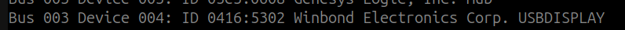
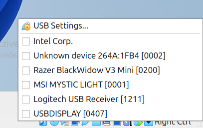

# Introduction

This section is to explain how I managed to find out how my device works. Hope this will be helpful for poeple who want
to do the same.

# Application description

The applcation is devided in two parts:

- The gui which is made to help configure and customize what is displayed on the screen.
- The device_controller which is the part that talks to the device.

Configuration files:

- gui_config.yaml: holds the configuration of the gui. The config file is under resources.
- config_{width}{height}.yaml: holds the configuration of what the device will display. Such as background, foreground
  and the metrics to display.
  Predefined config files are under resources/config.

Main class:

- service.py: the main class that starts the device_controller.
- main_gui.py: the main class that starts the gui.

I also added two bash scripts:

- run_service.sh: starts the service. Must be run as sudo.
- run_gui.sh: starts the gui.

# Tools

- Install a windows VM on virtualBox and install the official product software.
- Install wireshark.
- Install tshark command line tool.

# Configuring the official product software

On the windows VM, configure the display with simple color background with no foreground or text. Really just the
background.
I found out that the offcial product software adds many sequences of 0x00 in the paquet, for report id and as separator
for each raw of pixels.

I used to find it because I used the green background available in the official product software. It's hexadecimal does
not contain 0x00 at all.
Which means that all the 0x00 are part of the extra technical information added.
For each packet sent, there is a header that is added, and it's been challenging to fid its value until I used the green
background.

Save your configuration and make sure that if you restart the software, it will use the same configuration.

# Capturing packets

You need to run this command to make wirehsark reading usb packets.

```bash

  sudo modprobe usbmon

```

Use lsusb command to find out the usb Bus id and device id. Something like this:



In my case, the Bus id is 3 and the device id is 4.

Run wireshark with sudo, when it opens, select usbmon{Bus id}. In my case, it is usbmon3.

To find the packets sent to the device, you need to use this filter to have the packets you want:

```
    usb.device_address == {device id} && usb.transfer_type == 0x01 && usb.endpoint_address == 0x02 && usb.src == "host" 
```

- usb.device_addressm: The device id, in my case 4.
- usb.transfer_type: 0x01 for data transfer.
- usb.endpoint_address: 0x02 for data transfer.
- usb.src: host for data transfer.

If the application is running and the filter does not show any packets, remove usb.transfer_type and
usb.endpoint_address one by one and see if it works.

And try to find the correct value for the one that does not work. To do this:

- Select a paquet with the biggest length.
- Unfold the USB URB section.
- For usb.transfer_type, you can add the correct value by doing a right-click on "URB transfert type" and selecting "
  Apply as Filter" -> "...and Selected".
- For usb.endpoint_address, you can add the correct value by doing a right-click on "Endpoint" and selecting "Apply as
  Filter" -> "...and Selected".

In windows VM, keep the software running and disable the display usb from USB settings of virtualBox here:



Then go back to wireshark and restart the capture. If you are asked to save just select "Continue without saving".

Since wireshark filter is applied and USB on VM is disabled, you should not see any packets in Wireshark.

After that, enable the display usb from USB settings of virtualBox and wait to see packets in wireshark.

Click on stop after about a second from the time you see packets.

Then go to File -> Export Specified Packets, choose folder and name of the file then click save.

# Extract the data from the wireshark file

The wireshark can oonly be read by wireshark. This section is to explain how I managed to extract the data from the
wireshark file into simple text file in hexadeciamal format.

On terminal run this command:

```bash

  tshark -r /path-to-capture/yourcapturefile.pcapng -T fields -e usb.capdata > output.txt
  
```

In fields section, there is two possible values (or at least the ones that I've dealing with):

- usb.capdata : If in wireshark the section where the data is displayed is called "Leftover capture data"
- usbhid.data : If in wireshark the section where the data is displayed is called "HID Data"

Check output.txt if it contains the data you want.

# Clean output.txt

Even if you hit the "Stop" button in wireshark quickly, you will end up with multiple occurrences of the packets that
represent the image sent to the device.
The output.txt under doc section in this repository is an example of what you should get.
To clean the output.txt:

- I never understood what the first line of the file is for. It works even without duplicating it in my implementation.
  If you have one similar I think you can go and remove it.
- The second line is the beginning of the group of packets that represent the image sent to the device.
- To find the next occurrence and then remove all lines starting from there to the end.
- After cleaning the file, you end up with one like output_clean.txt.
- The hexadecimal representation of the image is a sequence of f597.
- And the header value is all hexadecimal characters that are before the first f597. And it is '
  dadbdcdd02000100f000400102000000005802000000'
- In the last line there is a sequence of 00 after the last f597. This is because the last part of the image is less
  than 512 bytes so it is padded with 00.
- Between every sequence of f597 there is a sequence of 0000, this sequence is added every 956 characters.
  This sequence is used as a separator for every row, In my case, the image is scanned from bottom to top and from left
  to right.
  So every time it hits the top, the sequence of 0000 is added.

# Testing the device

At this stage, you can go and implement your own device. An example with commentary is available in
`new_device_example.py`.

For naming class please use the convention in the `new_device_example.py`, please don't name the class using your
product name because the same VID/PID can be used in multiple products.

You're free to add new python file for the device or :

- Add it in `hid_devices.py` file, if the device uses hid interface.
- Add it in `usb_devices.py` file, if the device uses usb interface.

If you choose to add a new file, make sure you put vid/pid in file name for example `device_0418_5304.py`.

And then add your device in `SUPPORTED_DEVICES` variable in `device_loader.py` file.

In `resources/config`, there is pre-configured themes for different screen resolutions. Files are named as config_
{width}{height}.yaml.

If there is no theme for your screen resolution, you can create one by duplicating any of the available files

Update the config file, replace `/usr/share/thermalright-lcd-control` with  `./resources`.

If you added a new file, disable foreground by updating property `foreground.enabled` to `false` in the config file.

Later you can create a folder under `resources/themes/forgrounds/{width}{height}` and add foregrounds suited for your
screen resolution.

Make sure you stopped the windows VM and then run the bash script `run_service.sh` sudo to start the application.

If you're done well all the steps, you should see your device working.

# The screen displays a blurry image

I think that ThermalRight used the same logic to encode the image in the official product software. Finally, I hope so.

If the screen displays a blurry image, it means that the image is not encoded correctly.

Then you need to find out how the image is encoded for your device.

There is many ways to scan image, horizontal scan, vertical scan and from rigtht to left or left to right.

To figure out how the image is encoded, you need two simple color bars images, one horizontal and one vertical.
Use images with the same resolution as the screen.

Redo all steps to capture packets for these images until ending with a clean output file.

Using the green image result you can find out the value of the row separator, it could be something like the '0000'
sequence, and count the number of hexa character between two separators.

From the three files remove header and the tailing zeros from last line. Maybe it is not zero but other value but
you can find it thanks to the green image, everything after the last f597 should be removed.

Also, remove the '\n' or '\r' at the end of each line.

I used AI to figure out how image is encoded, I gave it the three images, their output explained to it the separator
logic.

Then asked it to figure out the encoding algorithm. To make sure that he give me the good one,
I tell it to generate an output file with the code and compare it to the ones that I gave it.
If it is not exactly the same then it must try another algorithm and so on until it finds the good one.

It took me a lot of time and effort to figure out how to prepare something clean for that AI can figure out how to
encode the image.

# Adding support for a new device on the gui

The last step is to add support for a new device on the gui.

To do that, you need to add a new device in `gui_config.yaml` file, under `supported_devices`.

I deliberately avoided putting a product name like `Frozen Wareframe` because the same device can be used in multiple
products, and therefore the concept of a product name loses all meaning.

# Add foreground images for the new device

If your device resolution does not match any of the pre-configured foregrounds, you can create a new folder under
`resources/themes/forgrounds/{width}{height}` and add foregrounds suited for your screen resolution.

You can get the ones under the official product software. For those already copied here, I used the ones under
`TRCCAPEN\Data\USBLCD\Web`.

Foregrounds are files under folders `zt*`, pick the one that matches your screen resolution. The folders contain
subfolders with the foreground image a config file and a preview of the theme. Just pick the png files and copy them
under `resources/themes/forgrounds/{width}{height}`.

# Add a new theme

Last step is to run the gui using the bash script `run_gui.sh` and configure a theme and save it.

The config file will be saved in `resources/themes/presets/{width}{height}/`.

Copy that file to `resources/config/` and rename it to `config_{width}{height}.yaml`.

**Note**: The application now automatically handles path resolution for different installation environments. You no longer need to manually change paths from `resources/` to `/usr/share/thermalright-lcd-control/` - this conversion happens automatically at runtime.

This theme will be used as default theme for new installations.

# Conclusion

That's it, now application is ready to be packaged and installed.
